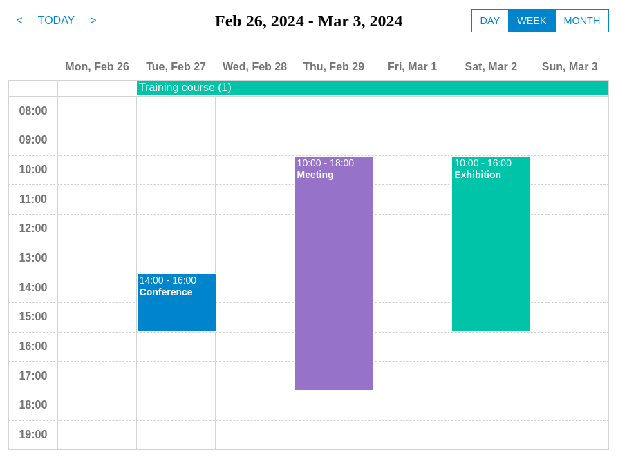

# @mormat/react-scheduler 

React scheduler component ([demo](https://mormat.github.io/react-scheduler/))

week view                 | month view
:-------------------------:|:-------------------------:
 | 

A [standalone version](#using-the-standalone-version) that can be installed in any HTML page without installing React is also available. 

## Available features
- switch between views `day`, `week` or `month`
- events can be loaded [statically](#loading-static-events) (from an array) or [dynamically](#loading-dynamic-events) (from an ajax request for instance)
- drag and drop events
- create/update/delete events
- few dependencies : only `React` (>= 17.0.0) and `ReactDOM` (>= 17.0.0) are required. The standalone version requires no dependencies at all.


## Usage in a React project

### Installing

```
npm install @mormat/react-scheduler
```

### Importing stylesheet

The stylesheet is required, otherwise, the scheduler will not be rendered properly.

There is several ways to include the stylesheet :

- With the [css-loader](https://github.com/webpack/css-loader) module if you're using webpack

```js
/*
 The following line can be included in your src/index.js or App.js file
*/
import "@mormat/react-scheduler/dist/mormat_react_scheduler.css";
```

- In the html template where the scheduler will displayed (using [unpkg](https://www.unpkg.com/))

```html
<head>
    ...
    <link 
        rel="stylesheet" 
        href="https://unpkg.com/@mormat/react-scheduler/dist/mormat_react_scheduler.css"
    >
</head>
```


### Loading static events

```js
import Scheduler from "@mormat/react-scheduler";

function App() {
    
    const events = [
        {
            label: "Meeting",
            start: "2024-02-28 10:00",
            end:   "2024-02-28 12:00",
        }
    ];

    return (
        <Scheduler 
            events      = { events } 
            initialDate = "2024-02-28"
        />
    );
    
}
```

### Loading dynamic events

@todo write example

## Using the component in an ordinary HTML page

### Loading the assets

```html
<head>
    ...
    <link rel="stylesheet" href="https://unpkg.com/@mormat/react-scheduler/dist/mormat_react_scheduler.css">
    <script src="https://unpkg.com/react@18/umd/react.development.js"></script>
    <script src="https://unpkg.com/react-dom@18/umd/react-dom.development.js"></script>
    <script src="https://unpkg.com/@mormat/react-scheduler"></script>
</head>
```

### Rendering the scheduler

#### With React 18
```html
<body>
    <div id="scheduler"></div>
    <script>
        var props = { 
            /* the same props used in a React project */ 
        };

        var reactElement = React.createElement(
            mormat_react_scheduler.Scheduler, 
            props
        );

        var container = document.getElementById('scheduler');
        var root      = ReactDOM.createRoot(container);
        root.render(reactElement);
    </script>
</body>
```

#### With React 17
```html
<body>
    <div id="scheduler"></div>
    <script>
        var props = { 
            /* the same props used in a React project */ 
        };

        var reactElement = React.createElement(
            mormat_react_scheduler.Scheduler, 
            props
        );

        var container = document.getElementById('scheduler');
        ReactDOM.render(reactElement, container);
    </script>
</body>
```

The available `props` can be found in [src/types.ts](src/types.ts)

## Using the standalone version

### Loading the assets

Download the assets **mormat_standalone_scheduler.js** and **mormat_standalone_scheduler.css** in the [release page](https://github.com/mormat/react-scheduler/releases/latest)

```html
<head>
    <link rel="stylesheet" href="./mormat_standalone_scheduler.css" >
    <script src="./mormat_standalone_scheduler.js"></script>
</head>
```

### Rendering the scheduler

```html
<body>
    <div id="scheduler"></div>
    <script>
        var props = { 
            /* the same props used in a React project */ 
        };

        mormat_standalone_scheduler.renderScheduler('#scheduler', props);
    </script>
</body>
```

The available `props` can be found in [src/types.ts](src/types.ts)

### Examples
#### Loading static events

```html
<script>
    var props = { 
        initialDate: '2024-02-01',
        events: [
            {
                label: 'Meeting',
                start: '2024-02-01 10:00',
                end:   '2024-02-01 12:00',
            },
            {
                label: 'Conference',
                start: '2024-02-01 14:00',
                end:   '2024-02-01 18:00',
            },
        ]
    };

    mormat_standalone_scheduler.renderScheduler('#scheduler', props);
</script>
```    

#### Loading dynamic events

@todo write example
